<!-- ==================== MISSION CONTROL: PRIMARY HUD ==================== -->

  

  

<!-- ==================== BENTO 01: ACTIVE MISSIONS (WIDE TOP + 2 SQUARES) ==================== -->

  

<!-- ==================== BENTO 02: SIDE-BY-SIDE TACTICAL MODULES ==================== -->

  
  

 

<!-- ==================== CORE TECH STACK ICONS ==================== -->

  

<!-- ==================== BENTO 03: SECURE FREQUENCY COMMS ==================== -->

  

ANAHEIM TACTICAL PROTOCOL // MARCELO PIRRO // ALL SYSTEMS OPERATIONAL

