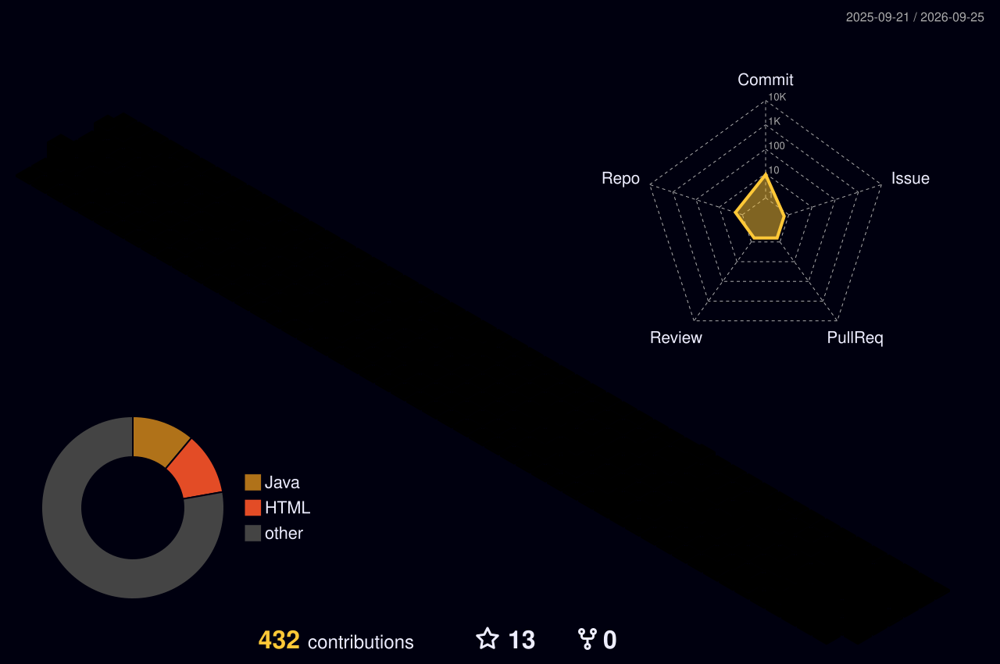

  

 

### `// 01. OPERATIONAL PROFILE & BACKGROUND`

<table>
  <tr>
    <td width="130" align="center" valign="middle">
      
    </td>
    <td valign="middle">
      <b>Software Engineer</b> specializing in <b>Backend Engineering, Distributed Systems & High-Availability Architectures</b>. Graduated in Computer Science from the <b>Federal University of São Carlos (UFSCar)</b>.  
      Focusing on mission-critical transactional platforms, event-driven streaming pipelines, and microservices built to withstand stringent financial SLAs and zero-downtime demands.
        
      <code>LOCATION:</code> São Paulo, Brazil &nbsp;|&nbsp; <code>STATUS:</code> Active Engineering &nbsp;|&nbsp; <code>CLEARANCE:</code> AWS CLF-C02
    </td>
  </tr>
</table>

- 💳 **Current Operations // Conexão Tech (Itaú Group)**  
  Developing and scaling high-availability payment processing backends with **Java**, **Spring Boot**, and **Apache Kafka**, handling high-volume financial traffic with stringent SLA, security, and idempotency guarantees.

- ✈️ **Past Impact // Embraer (Operational Excellence - P3E)**  
  Engineered enterprise process automation engines, modernizing industrial workflows and eliminating over **350+ operational hours per month**.

- 📐 **Architecture & Engineering Standards**  
  Clean Architecture, Domain-Driven Design (DDD), Event-Driven Architecture (EDA), SOLID, TDD, Resilient Microservices, and Fault-Tolerant Distributed Systems.

- 🎓 **Academic Foundation**  
  B.S. in Computer Science — **Universidade Federal de São Carlos (UFSCar)** (2021 – 2025).

- ☁️ **Cloud Certification**  
  **AWS Certified Cloud Practitioner** (`CLF-C02`).

 

---

### `// 02. TECHNICAL ARSENAL & CORE STACK`

| Vector | Technologies, Frameworks & Tooling |
| :--- | :--- |
| **Languages** | `Java 17/21` • `Python` • `TypeScript` • `JavaScript` • `SQL` • `C` |
| **Backend & Frameworks** | `Spring Boot` • `Quarkus` • `Hibernate / JPA` • `JDBC` • `RESTful APIs` • `SOAP` |
| **Messaging & Streaming** | `Apache Kafka` • `RabbitMQ` • `Event-Driven Architecture` • `Message Queuing` |
| **Data & Persistence** | `PostgreSQL` • `Oracle Database` • `MySQL` • `MongoDB` • `Redis` |
| **Cloud, DevOps & CI/CD** | `AWS (Certified)` • `Docker` • `Kubernetes` • `GitHub Actions CI/CD` • `Linux` |
| **Testing & Quality** | `JUnit 5` • `Mockito` • `TDD` • `Clean Code` • `Agile / SCRUM` |
| **Frontend Interop** | `React` • `HTML5 / Modern CSS` • `Astro` |

 

  

 

---

### `// 03. TELEMETRY & 3D CONTRIBUTION MESH`

  

 

| Protocol | Specification | Status |
| :---: | :---: | :---: |
| **Primary Focus** | High-Availability Distributed Systems | `100% OPERATIONAL` |
| **Target Architecture** | Event-Driven & Microservices (Clean Arch / DDD) | `OPTIMIZED` |
| **Core Cloud Provider** | Amazon Web Services (AWS Certified) | `VERIFIED` |
| **Financial SLA Target** | Mission-Critical Payment Resiliency | `STRICT` |

 

---

### `// 04. FEATURED TRANSMISSIONS & BENCHMARKS`

Tactical engineering write-ups and architectural deep dives published on [marcelopirro.vercel.app/transmissions](https://marcelopirro.vercel.app/transmissions):

- ⚡ **[Spring Boot vs Quarkus // Processing Cost & Performance Benchmark](https://marcelopirro.vercel.app/transmissions/spring-boot-vs-quarkus-processing-cost)**  
  In-depth benchmark comparing memory footprint, startup time, and cloud runtime cost for enterprise microservices.

- ☁️ **[AWS Certified Cloud Practitioner Journey // Tactical Dispatch](https://marcelopirro.vercel.app/transmissions/aws-certified-cloud-practitioner-journey)**  
  Preparation methodology, core architectural pillars, and cloud foundation strategies.

- 🚀 **[Academic & Career Odyssey // UFSCar → Embraer → Conexão Tech](https://marcelopirro.vercel.app/transmissions/graduation-ufscar-embraer-to-itau)**  
  Retrospective on software engineering at scale from aerospace automation to financial payments.

 

---

### `// 05. SECURE COMMS & TRANSMISSION`

Initiate a secure communication frequency for backend architecture, high-throughput distributed systems, or engineering collaboration:

- 🌐 **Tactical Portfolio**: [marcelopirro.vercel.app](https://marcelopirro.vercel.app/)
- 💼 **LinkedIn Profile**: [linkedin.com/in/marcelopirro](https://www.linkedin.com/in/marcelopirro)
- 📬 **Direct Dispatch**: [marcelopirro@outlook.com](mailto:marcelopirro@outlook.com)

 

  ANAHEIM TACTICAL MECHA SPEC // MARCELO PIRRO // ALL SYSTEMS NOMINAL

