  

  

<!-- ==================== 01. OPERATIONAL BACKGROUND ==================== -->

  

<!-- ==================== 02. TECHNICAL ARSENAL ==================== -->

  

  

<!-- ==================== 03. FEATURED TRANSMISSIONS ==================== -->

 

| Transmission | Architecture Topic | Direct Link |
| :--- | :--- | :---: |
| **TRANS-01** | `Spring Boot vs Quarkus // Processing Cost & Latency Benchmark` | [Read Dispatch ↗](https://marcelopirro.vercel.app/transmissions/spring-boot-vs-quarkus-processing-cost) |
| **TRANS-02** | `AWS Certified Cloud Practitioner Journey // Tactical Dispatch` | [Read Dispatch ↗](https://marcelopirro.vercel.app/transmissions/aws-certified-cloud-practitioner-journey) |
| **TRANS-03** | `Engineering Odyssey // UFSCar → Embraer → Conexão Tech` | [Read Dispatch ↗](https://marcelopirro.vercel.app/transmissions/graduation-ufscar-embraer-to-itau) |

  

<!-- ==================== 04. SECURE COMMS ==================== -->

 

ANAHEIM TACTICAL PROTOCOL // MARCELO PIRRO // ALL SYSTEMS OPERATIONAL

